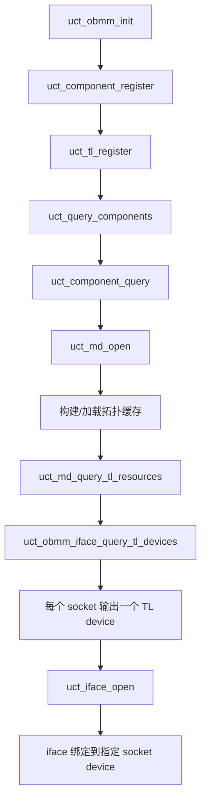
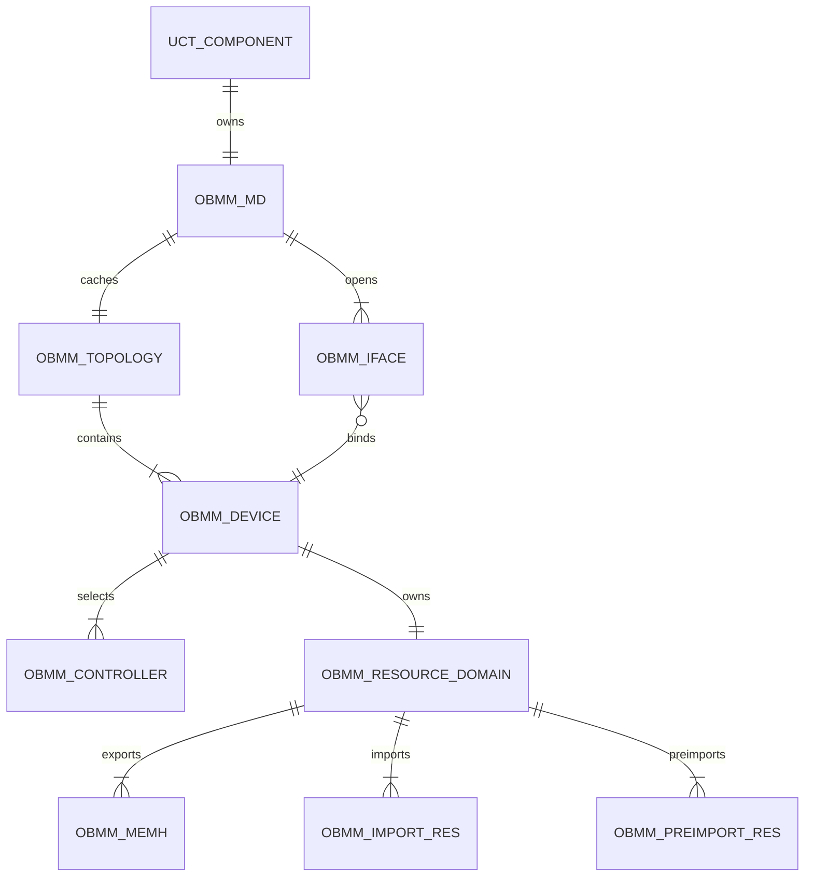
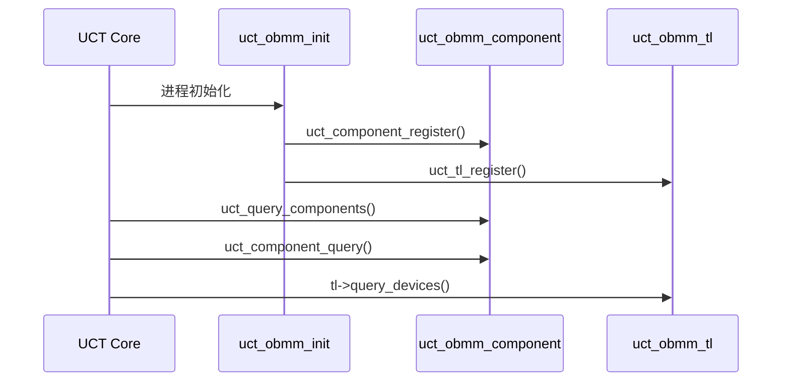
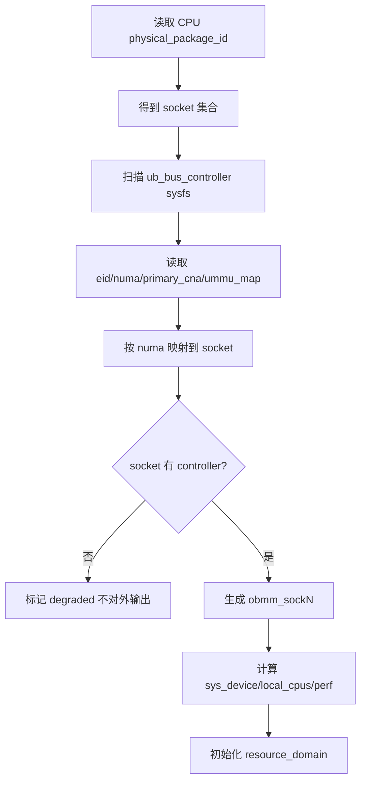
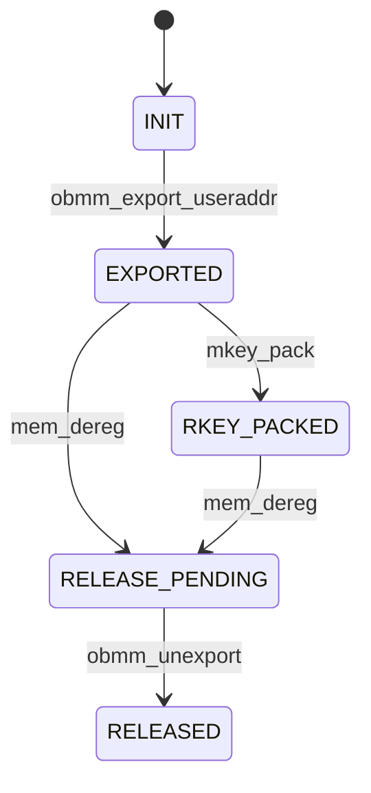
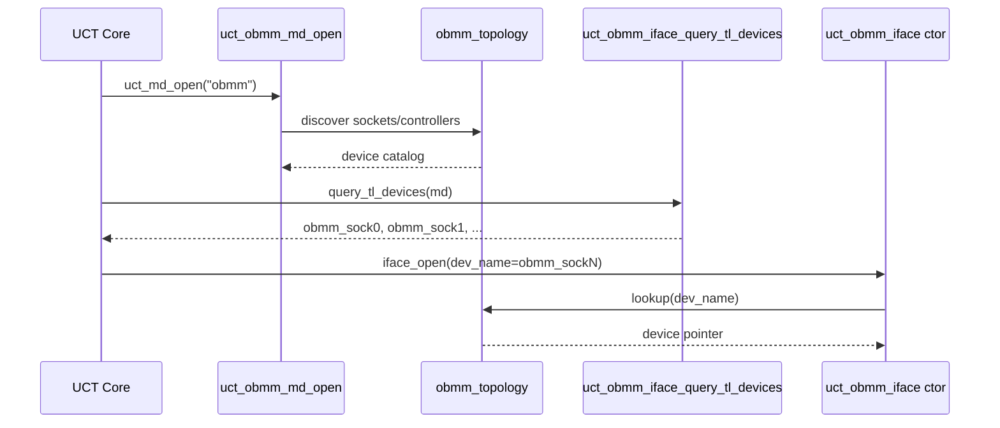
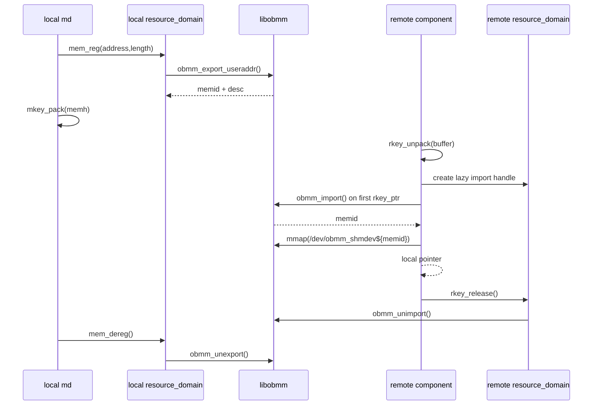

# `uct_obmm` 设备管理模块详细设计（接口维度）

## 1. 文档范围

本文只覆盖 `uct_obmm` 的**设备管理模块**，不展开连接管理模块和基础语义模块的数据面/一致性面实现。本文把 `uct_obmm` 视为一个完整的 UCT TL，并按接口维度对以下内容逐个做详细设计：

1. 设备的硬件发现与注册。
2. 设备能力与属性发布。
3. 资源隔离与资源生命周期管理。
4. `obmm` TL 与 component 的对外注册链路。

本文默认运行环境为 **Linux + UCX + libobmm**。其中 OBMM 相关运行时约束来自 `obmm/doc/*.md`、`obmm/src/libobmm/libobmm.h`、`obmm/src/libobmm/libobmm.c`、`obmm/src/libobmm/vendor_adaptor.c`；UCT 扩展点来自 `ucx/src/uct/base/*`、`ucx/src/uct/sm/*` 与当前 `ucx/src/uct/obmm/base/*`。

---

## 2. 设计目标与边界

### 2.1 设计目标

1. 让 `uct_obmm` 能像标准 UCT TL 一样，被 `uct_query_components()`、`uct_component_query()`、`uct_md_open()`、`uct_md_query_tl_resources()`、`uct_iface_open()` 正常发现和打开。
2. 在 `query_tl_devices()` 阶段，将**节点内每个 CPU socket 视为一个 device**，稳定输出 `tl_resource`。
3. 为每个 socket device 提供可交付的能力模型：设备类型、带宽、时延、sys_device、地址长度、可达性判断等。
4. 建立生产可用的资源域管理：导出、引入、预引入、rkey 打包/解包、释放、隔离、并发保护、错误映射。
5. 设计必须与 UCX 现有 `component -> md -> tl -> iface` 生命周期兼容，避免引入旁路注册模型。

### 2.2 非目标

1. 不在本文中展开 EP 连接建链和连接状态机。
2. 不在本文中展开 AM/PUT/GET/ATOMIC 语义实现。
3. 不修改 OBMM ABI，不重新设计 `libobmm`。

---

## 3. 设计依据

### 3.1 UCX/UCT 代码依据

| 类别 | 路径/符号 | 设计用途 |
| --- | --- | --- |
| component 注册 | `ucx/src/uct/base/uct_component.c` 中 `UCT_TL_DECL(obmm)`、`uct_obmm_init()` | 说明 `obmm` 如何进入全局 component 枚举 |
| TL 注册宏 | `ucx/src/uct/base/uct_iface.h` 中 `UCT_TL_DEFINE_ENTRY`、`UCT_SINGLE_TL_INIT` | 说明 TL/component 的正式注册方式 |
| TL 资源汇总 | `ucx/src/uct/base/uct_md.c` 中 `uct_md_query_tl_resources()` | 说明 `query_devices()` 的返回如何变成 `uct_tl_resource_desc_t` |
| 单设备参考 | `ucx/src/uct/sm/base/sm_iface.c` 中 `uct_sm_base_query_tl_devices()` | 说明 SHM TL 的基线做法 |
| 多设备参考 | `ucx/src/uct/tcp/tcp_iface.c` 中 `uct_tcp_query_devices()` | 说明按真实设备枚举多个 resource 的模式 |
| SHM iface 能力参考 | `ucx/src/uct/sm/mm/base/mm_iface.c` | 说明 `iface_query()` 的能力发布习惯 |
| 当前骨架 | `ucx/src/uct/obmm/base/obmm_md.c`、`obmm_iface.c`、`obmm_ep.c` | 说明当前占位点和需要替换的接口 |

### 3.2 OBMM 代码与文档依据

| 类别 | 路径/符号 | 设计用途 |
| --- | --- | --- |
| 公共 ABI | `obmm/src/libobmm/libobmm.h` | `obmm_mem_desc`、`obmm_preimport_info`、`obmm_import` 等入参与约束 |
| 导出/引入实现 | `obmm/src/libobmm/libobmm.c` | 说明 export/import/preimport/unimport 的控制面顺序和 errno 语义 |
| 控制器拓扑 | `obmm/src/libobmm/vendor_adaptor.c` | 说明通过 `/sys/devices/ub_bus_controller*/...` 获取 `eid/numa/primary_cna/ummu_map` |
| 总体约束 | `obmm/doc/libobmm.md` | 说明粒度、NUMA、ownership、export-import-unimport-unexport 顺序 |
| import 约束 | `obmm/doc/obmm_import.md` | 说明 `ALLOW_MMAP/NUMA_REMOTE/PREIMPORT/base_dist` 的规则 |
| preimport 约束 | `obmm/doc/obmm_preimport.md` | 说明预引入的匹配键和资源冲突约束 |

### 3.3 Chroma 检索命中

本设计还基于本地 Chroma 库 `.\.artifacts\chromadb` 的文档命中结果做了交叉确认，重点命中如下符号：

- `uct_sm_base_query_tl_devices`
- `UCT_TL_DEFINE_ENTRY`
- `uct_single_device_resource`
- `obmm_import`
- `vendor_fixup_import_cmd`
- `obmm_preimport_info`

这些命中对应的路径包括：

- `ucx/src/uct/sm/base/sm_iface.c`
- `ucx/src/uct/base/uct_iface.h`
- `ucx/src/uct/base/uct_iface.c`
- `obmm/src/libobmm/libobmm.c`
- `obmm/src/libobmm/vendor_adaptor.c`
- `obmm/doc/libobmm.md`

---

## 4. 总体设计概览

### 4.1 模块分层

设备管理模块在 `uct_obmm` 内部分为四层：

1. **注册层**：负责 component/TL 的注册和反注册。
2. **拓扑层**：负责发现本地 CPU socket、UB controller，并建立 socket-device 目录。
3. **能力层**：负责把 device 目录映射为 `MD attr`、`TL device resource`、`iface attr`。
4. **资源层**：负责导出、引入、预引入、rkey 句柄、资源配额、状态和释放。

### 4.2 生命周期主线



### 4.3 落地文件规划

建议最终代码拆分如下：

| 文件 | 职责 |
| --- | --- |
| `ucx/src/uct/obmm/base/obmm_md.h/.c` | component、MD 生命周期、MD attr、mem_reg/mem_dereg/mkey_pack |
| `ucx/src/uct/obmm/base/obmm_iface.h/.c` | TL device 查询、iface attr、地址与可达性 |
| `ucx/src/uct/obmm/base/obmm_device.h/.c` | socket/controller 发现、device 目录、perf 模型 |
| `ucx/src/uct/obmm/base/obmm_resource.h/.c` | export/import/preimport/rkey 资源域与隔离 |

---

## 5. 对象定义

## 5.1 核心对象关系



## 5.2 核心结构体

> 下述结构体是设备管理模块的正式设计对象；其中 `uct_obmm_md_t`、`uct_obmm_iface_t` 会直接扩展现有骨架。

### 5.2.1 `uct_obmm_controller_t`

```c
typedef struct uct_obmm_controller {
    uint8_t           eid[16];
    uint32_t          primary_cna;
    int               numa_id;
    int               socket_id;
    int               ummu_mapping;
    char              sysfs_path[PATH_MAX];
    uint64_t          flags;
} uct_obmm_controller_t;
```

| 字段 | 含义 |
| --- | --- |
| `eid` | 本地 UB controller 的 EID，来自 sysfs |
| `primary_cna` | 对应 controller 的主 CNA，供 import/preimport 校验 |
| `numa_id` | controller 所在 NUMA 节点 |
| `socket_id` | 由 `numa_id -> socket_id` 映射得出 |
| `ummu_mapping` | vendor 信息初始化时需要的 UMMU 路由信息 |
| `sysfs_path` | `/sys/devices/ub_bus_controller*/...` 实际路径 |

### 5.2.2 `uct_obmm_device_caps_t`

```c
typedef struct uct_obmm_device_caps {
    uct_device_type_t type;
    ucs_sys_device_t  sys_device;
    double            dedicated_bw;
    double            shared_bw;
    ucs_linear_func_t latency;
    double            overhead;
    size_t            reg_alignment;
    size_t            obmm_granularity;
    uint64_t          iface_flags;
    uint64_t          md_flags;
} uct_obmm_device_caps_t;
```

### 5.2.3 `uct_obmm_device_t`

```c
typedef struct uct_obmm_device {
    char                    name[UCT_DEVICE_NAME_MAX];
    uint32_t                index;
    int                     socket_id;
    int                     numa_id;
    ucs_cpu_set_t           local_cpus;
    uct_obmm_controller_t  *primary_ctl;
    uct_obmm_controller_t  *controllers;
    unsigned                num_controllers;
    uct_obmm_device_caps_t  caps;
    struct uct_obmm_resource_domain *res_domain;
    ucs_spinlock_t          lock;
    uint64_t                generation;
    uint64_t                flags;
} uct_obmm_device_t;
```

### 5.2.4 `uct_obmm_topology_t`

```c
typedef struct uct_obmm_topology {
    uct_obmm_device_t      *devices;
    unsigned                num_devices;
    uct_obmm_controller_t  *controllers;
    unsigned                num_controllers;
    size_t                  obmm_granularity;
    uint64_t                generation;
    uint64_t                flags;
} uct_obmm_topology_t;
```

### 5.2.5 `uct_obmm_resource_domain_t`

```c
typedef struct uct_obmm_resource_domain {
    ucs_spinlock_t     lock;
    size_t             export_bytes;
    size_t             import_bytes;
    size_t             preimport_bytes;
    size_t             max_export_bytes;
    size_t             max_import_bytes;
    size_t             max_preimport_bytes;
    unsigned           num_exports;
    unsigned           num_imports;
    unsigned           num_preimports;
    khash_t(obmm_memh) *exports;
    khash_t(obmm_imp)  *imports;
    khash_t(obmm_pre)  *preimports;
} uct_obmm_resource_domain_t;
```

### 5.2.6 `uct_obmm_memh_t`

```c
typedef enum uct_obmm_memh_state {
    UCT_OBMM_MEMH_INIT,
    UCT_OBMM_MEMH_EXPORTED,
    UCT_OBMM_MEMH_RKEY_PACKED,
    UCT_OBMM_MEMH_RELEASE_PENDING,
    UCT_OBMM_MEMH_RELEASED
} uct_obmm_memh_state_t;

typedef struct uct_obmm_memh {
    mem_id                 memid;
    void                  *address;
    size_t                 length;
    int                    device_index;
    uint32_t               tokenid;
    uint8_t                seid[16];
    uint8_t                deid[16];
    uint32_t               scna;
    uint32_t               dcna;
    uint16_t               priv_len;
    unsigned long          export_flags;
    uct_obmm_memh_state_t  state;
    uint32_t               refcount;
} uct_obmm_memh_t;
```

### 5.2.7 `uct_obmm_import_res_t`

```c
typedef enum uct_obmm_import_state {
    UCT_OBMM_IMPORT_INIT,
    UCT_OBMM_IMPORT_PREIMPORTED,
    UCT_OBMM_IMPORT_IMPORTED,
    UCT_OBMM_IMPORT_MAPPED,
    UCT_OBMM_IMPORT_RELEASE_PENDING,
    UCT_OBMM_IMPORT_RELEASED
} uct_obmm_import_state_t;

typedef struct uct_obmm_import_res {
    mem_id                    memid;
    int                       device_index;
    int                       numa_id;
    unsigned long             import_flags;
    unsigned long             base_dist;
    uint64_t                  remote_addr;
    size_t                    length;
    void                     *mapped_addr;
    uct_obmm_import_state_t   state;
    uint32_t                  refcount;
} uct_obmm_import_res_t;
```

### 5.2.8 `uct_obmm_packed_rkey_v1_t`

```c
typedef struct uct_obmm_packed_rkey_v1 {
    uint16_t version;
    uint16_t flags;
    uint32_t device_index;
    uint64_t memid;
    uint64_t remote_addr;
    uint64_t length;
    uint32_t tokenid;
    uint32_t scna;
    uint32_t dcna;
    uint8_t  seid[16];
    uint8_t  deid[16];
    uint16_t priv_len;
    uint16_t reserved;
    uint8_t  priv[];
} UCS_S_PACKED uct_obmm_packed_rkey_v1_t;
```

### 5.2.9 `uct_obmm_iface_t`

```c
typedef struct uct_obmm_iface_addr {
    uint16_t version;
    uint16_t device_index;
    uint32_t md_generation;
    uint64_t iface_uuid;
} UCS_S_PACKED uct_obmm_iface_addr_t;

typedef struct uct_obmm_iface {
    uct_sm_iface_t        super;
    uint64_t              iface_uuid;
    uct_obmm_device_t    *device;
    uint32_t              md_generation;
} uct_obmm_iface_t;
```

### 5.2.10 `uct_obmm_md_t`

```c
typedef struct uct_obmm_md {
    uct_md_t                super;
    uct_obmm_topology_t     topology;
    ucs_spinlock_t          lock;
    ucs_cpu_set_t           union_local_cpus;
    uint64_t                generation;
    uct_obmm_md_config_t    config;
} uct_obmm_md_t;
```

---

## 6. 接口总表

## 6.1 UCT 可见接口

| 分组 | 接口 | 角色 |
| --- | --- | --- |
| 注册 | `uct_obmm_init()` / `uct_obmm_cleanup()` | TL/component 注册与反注册 |
| component | `uct_obmm_component.query_md_resources` | 向 UCT 暴露 MD 资源 |
| MD | `uct_obmm_md_open()` | 打开 MD 并加载设备目录 |
| MD | `uct_obmm_md_close()` | 关闭 MD 并释放设备/资源域 |
| MD | `uct_obmm_md_query()` | 发布 MD 能力 |
| TL | `uct_obmm_iface_query_tl_devices()` | 输出 socket 级 device 列表 |
| iface | `uct_obmm_iface_query()` | 发布 device 级 iface 能力 |
| iface | `uct_obmm_iface_get_address()` | 输出 iface 地址 |
| iface | `uct_obmm_iface_is_reachable_v2()` | 校验可达性 |
| MD 资源 | `uct_obmm_md_mem_reg()` | 导出本地内存并建立 memh |
| MD 资源 | `uct_obmm_md_mkey_pack()` | 打包 OBMM rkey |
| component | `uct_obmm_md_rkey_unpack()` | 解包远端 rkey 并建立 import 句柄 |
| component | `uct_obmm_rkey_ptr()` | 将远端 OBMM 资源转换为本地可访问指针 |
| component | `uct_obmm_rkey_release()` | 释放 unpack/import 句柄 |
| MD 资源 | `uct_obmm_md_mem_dereg()` | 取消导出并销毁 memh |

## 6.2 模块间服务接口

这些接口不直接暴露给 UCT Core，但对 `uct_obmm` 其他子模块可见：

| 接口 | 用途 |
| --- | --- |
| `uct_obmm_topology_discover()` | 发现 socket/controller 拓扑 |
| `uct_obmm_device_catalog_lookup()` | 按 `dev_name` 查找 device |
| `uct_obmm_preimport_reserve()` / `uct_obmm_preimport_release()` | 管理预引入资源 |
| `uct_obmm_import_acquire()` / `uct_obmm_import_release()` | 管理远端导入资源 |
| `uct_obmm_errno_to_ucs_status()` | 统一错误码映射 |

---

## 7. TL 与 component 对外注册设计

## 7.1 注册模型

`uct_obmm` 必须沿用 UCX 现有宏注册模型，不允许手工追加旁路链表。正式设计如下：

1. 在 `ucx/src/uct/obmm/base/obmm_iface.c` 使用 `UCT_TL_DEFINE_ENTRY(&uct_obmm_component, obmm, ...)` 定义 TL 实体。
2. 在同文件使用 `UCT_SINGLE_TL_INIT(&uct_obmm_component, obmm,,, )` 生成 `uct_obmm_init()`/`uct_obmm_cleanup()`。
3. 在 `ucx/src/uct/base/uct_component.c` 保留 `UCT_TL_DECL(obmm)`、`uct_init()->uct_obmm_init()`、`uct_cleanup()->uct_obmm_cleanup()`。
4. `uct_obmm_init()` 调用顺序固定为：
   1. `uct_component_register(&uct_obmm_component)`
   2. `uct_tl_register(&uct_obmm_component, &uct_obmm_tl)`
5. `uct_obmm_cleanup()` 顺序反向执行。

## 7.2 设计原因

这是因为 UCX 的 component 枚举和 TL 资源查询分别走两条链：

- `uct_query_components()` 只看全局 `uct_components_list`
- `uct_md_query_tl_resources()` 只看 `component->tl_list`

少任一注册动作，都会导致 `obmm` 在 UCT Core 视角不可见。

## 7.3 注册时序图



---

## 8. 硬件发现与注册接口组

## 8.1 `uct_obmm_component.query_md_resources`

### 8.1.1 接口定义

```c
ucs_status_t uct_obmm_query_md_resources(uct_component_t *component,
                                         uct_md_resource_desc_t **resources_p,
                                         unsigned *num_resources_p);
```

### 8.1.2 输入/输出

| 参数 | 方向 | 说明 |
| --- | --- | --- |
| `component` | in | 必须为 `&uct_obmm_component` |
| `resources_p` | out | 返回 MD 资源数组 |
| `num_resources_p` | out | 返回 MD 数量 |

### 8.1.3 设计

1. 该接口继续保持**单 MD** 模型，对外只发布一个 MD 资源，名称固定为 `"obmm"`。
2. 若本机无可用 socket device，也**不在这里**隐藏 MD；MD 仍可被打开，由 `query_tl_devices()` 返回 0 个 TL device。
3. 原因是：
   - `query_md_resources()` 代表 component 是否具备 MD 入口；
   - `query_tl_devices()` 才代表该 MD 当前是否有可用 transport device。

### 8.1.4 返回码

- `UCS_OK`
- `UCS_ERR_NO_MEMORY`

---

## 8.2 `uct_obmm_md_open`

### 8.2.1 接口定义

```c
ucs_status_t uct_obmm_md_open(uct_component_t *component,
                              const char *md_name,
                              const uct_md_config_t *config,
                              uct_md_h *md_p);
```

### 8.2.2 输入/输出

| 参数 | 方向 | 说明 |
| --- | --- | --- |
| `component` | in | 必须为 `&uct_obmm_component` |
| `md_name` | in | 只接受 `"obmm"` |
| `config` | in | `uct_obmm_md_config_t` |
| `md_p` | out | 输出 `uct_obmm_md_t` |

### 8.2.3 处理逻辑

1. 校验 `md_name == "obmm"`，否则返回 `UCS_ERR_NO_DEVICE`。
2. 分配 `uct_obmm_md_t`。
3. 克隆并持有 MD 配置。
4. 初始化 `md->lock`、`md->generation`。
5. 调用 `uct_obmm_topology_discover()` 构建拓扑缓存。
6. 聚合所有 device 的 `local_cpus`，写入 `md->union_local_cpus`。
7. 初始化 `md_ops`：
   - `query = uct_obmm_md_query`
   - `mem_reg = uct_obmm_md_mem_reg`
   - `mem_dereg = uct_obmm_md_mem_dereg`
   - `mkey_pack = uct_obmm_md_mkey_pack`
   - `mem_attach = ucs_empty_function_return_unsupported`
   - `detect_memory_type = ucs_empty_function_return_unsupported`
8. 绑定 `md->super.component = &uct_obmm_component`。

### 8.2.4 关键设计点

1. **拓扑发现发生在 `md_open`，不发生在 `query_md_resources`。**
   - 因为 device 列表依赖本地 runtime 拓扑和 sysfs。
   - `md_open` 之后的 `query_tl_devices` 必须是低成本只读路径。
2. **拓扑缓存属于 MD，不属于全局单例。**
   - 避免多 component/多进程复用中的生命周期交叉。
3. **每个 socket 建一个 `uct_obmm_device_t`。**
   - 这是本设计对用户给定硬件约束的正式落地。

### 8.2.5 错误处理

| 场景 | 返回值 |
| --- | --- |
| 参数非法 | `UCS_ERR_INVALID_PARAM` |
| 分配失败 | `UCS_ERR_NO_MEMORY` |
| sysfs/拓扑发现失败且无法继续 | `UCS_ERR_NO_DEVICE` |
| 部分 socket 不可用 | `UCS_OK`，但只保留健康 device |

---

## 8.3 `uct_obmm_topology_discover`

### 8.3.1 接口定义

```c
ucs_status_t uct_obmm_topology_discover(uct_obmm_md_t *md,
                                        uct_obmm_topology_t *topology);
```

### 8.3.2 输入/输出

| 参数 | 方向 | 说明 |
| --- | --- | --- |
| `md` | in | MD 上下文和配置 |
| `topology` | out | 输出设备与 controller 目录 |

### 8.3.3 处理逻辑

1. 枚举本地 CPU，按 `physical_package_id` 聚合成 socket 集合。
2. 枚举 `/sys/devices/ub_bus_controller*/.../ubc`。
3. 读取每个 controller 的：
   - `eid`
   - `numa`
   - `primary_cna`
   - `ummu_map`
4. 依据 `controller.numa_id -> socket_id` 建立 controller 到 socket 的归属。
5. 对每个 socket 生成一个 `uct_obmm_device_t`：
   - `name = "obmm_sock<socket_id>"`
   - `type = UCT_DEVICE_TYPE_SHM`
   - `sys_device = socket 对应的 sys_device，无法解析时为 UCS_SYS_DEVICE_ID_UNKNOWN`
6. 每个 socket 选择一个 `primary_ctl`：
   - 优先同 socket NUMA 的 controller
   - 多个时按 `ummu_mapping` 和配置优先级排序
7. 若 socket 无可用 controller：
   - 标记该 socket 为 `DEGRADED`
   - 默认不纳入 `query_tl_devices()` 输出
8. 计算 `obmm_granularity`：
   - 缺省 2 MiB
   - 若将来可从 sysfs/ioctl 获取真实粒度，则以 runtime 值覆盖

### 8.3.4 设计约束

1. **device 抽象单位是 socket，不是 NUMA node，也不是 controller。**
2. **controller 是 device 的路由资源，不直接对外输出为 TL device。**
3. **一个 socket 可以挂多个 controller，但只对外暴露一个 UCT device。**

### 8.3.5 发现流程图



---

## 8.4 `uct_obmm_iface_query_tl_devices`

### 8.4.1 接口定义

```c
ucs_status_t uct_obmm_iface_query_tl_devices(uct_md_h md,
                                             uct_tl_device_resource_t **tl_devices_p,
                                             unsigned *num_tl_devices_p);
```

### 8.4.2 输入/输出

| 参数 | 方向 | 说明 |
| --- | --- | --- |
| `md` | in | `uct_obmm_md_t` |
| `tl_devices_p` | out | 返回 device 数组 |
| `num_tl_devices_p` | out | 返回 device 数量 |

### 8.4.3 处理逻辑

1. 把 `md` 转为 `uct_obmm_md_t`。
2. 遍历 `md->topology.devices`。
3. 过滤条件：
   - `primary_ctl != NULL`
   - device 状态非 degraded
   - resource_domain 初始化成功
4. 为每个合格 device 填充一个 `uct_tl_device_resource_t`：
   - `name = device->name`
   - `type = UCT_DEVICE_TYPE_SHM`
   - `sys_device = device->caps.sys_device`
5. 分配连续数组并返回。

### 8.4.4 关键设计点

1. **本接口必须是无副作用查询接口**，不能在这里做 export/import/preimport。
2. **本接口必须稳定返回相同命名**，保证 `params->mode.device.dev_name` 可回放。
3. `dev_name` 命名规则固定为：
   - `obmm_sock0`
   - `obmm_sock1`
   - ...

### 8.4.5 与 UCX Core 的关系

`uct_md_query_tl_resources()` 会把该接口输出的每个 device 转成一个 `uct_tl_resource_desc_t`。因此本接口是“每个 socket 一个资源”的唯一落点。

---

## 9. 设备能力与属性接口组

## 9.1 `uct_obmm_md_query`

### 9.1.1 接口定义

```c
ucs_status_t uct_obmm_md_query(uct_md_h md, uct_md_attr_v2_t *attr);
```

### 9.1.2 发布字段

| 字段 | 设计值 | 说明 |
| --- | --- | --- |
| `flags` | `UCT_MD_FLAG_REG | UCT_MD_FLAG_NEED_RKEY` | 设备管理阶段支持注册和远端 key |
| `max_reg` | `SIZE_MAX` 与运行时粒度校验共同生效 | 实际受 OBMM 对齐/资源限制约束 |
| `reg_mem_types` | `HOST` | 仅主机内存 |
| `reg_nonblock_mem_types` | `0` | `obmm_export_useraddr()` 涉及 pin/check，不发布非阻塞注册 |
| `cache_mem_types` | `HOST` | 允许缓存 host memh 元数据 |
| `alloc_mem_types` | `0` | 本期不通过 MD alloc 暴露 OBMM 池分配 |
| `access_mem_types` | `HOST` | 访问 host 映射 |
| `component_name` | `"obmm"` | 固定值 |
| `rkey_packed_size` | `sizeof(uct_obmm_packed_rkey_v1_t) + priv_len` | 变长打包 |
| `local_cpus` | 全部健康 socket 的 CPU 并集 | 供 UCP 拓扑选择 |
| `reg_alignment` | `topology.obmm_granularity` | 默认 2 MiB |

### 9.1.3 设计原因

1. 不发布 `ALLOC`：UCT MD alloc 的语义是通用分配接口，而 `obmm_export()` 直接分配 OBMM 池内存属于后续扩展项，不作为本期设备管理模块的对外 UCT 契约。
2. 不发布 `REG_NONBLOCK`：OBMM export 是同步控制面动作，不能误导上层做无阻塞注册假设。

---

## 9.2 `uct_obmm_iface_query`

### 9.2.1 接口定义

```c
ucs_status_t uct_obmm_iface_query(uct_iface_h tl_iface,
                                  uct_iface_attr_t *attr);
```

### 9.2.2 输入/输出

| 参数 | 方向 | 说明 |
| --- | --- | --- |
| `tl_iface` | in | `uct_obmm_iface_t` |
| `attr` | out | 输出 iface 能力 |

### 9.2.3 依赖对象

`uct_obmm_iface_t` 必须已经绑定一个 `uct_obmm_device_t`。因此 `iface constructor` 必须先按 `dev_name` 完成 device 解析。

### 9.2.4 发布字段

| 字段 | 设计值 |
| --- | --- |
| `cap.flags` | `UCT_IFACE_FLAG_CONNECT_TO_IFACE | UCT_IFACE_FLAG_CB_SYNC | UCT_IFACE_FLAG_EP_CHECK` |
| `device_addr_len` | `uct_sm_iface_get_device_addr_len()` |
| `iface_addr_len` | `sizeof(uct_obmm_iface_addr_t)` |
| `ep_addr_len` | `0` |
| `max_conn_priv` | `0` |
| `cap.am/put/get/atomic` | 在基础语义模块交付前全部置 0 |
| `latency` | `device->caps.latency` |
| `bandwidth.dedicated` | `device->caps.dedicated_bw` |
| `bandwidth.shared` | `device->caps.shared_bw` |
| `overhead` | `device->caps.overhead` |
| `priority` | 缺省 0，可按 socket/NUMA 距离微调 |

### 9.2.5 性能模型

设备性能值按以下规则生成：

1. `dedicated_bw = min(local_socket_mem_bw, obmm_link_bw)`
2. `shared_bw = per_socket_shared_bw`
3. `latency = ucs_linear_func_make(base_latency_sec, 0)`
4. `overhead = send path software overhead`

若运行时无法获取真实链路带宽，则优先使用配置项：

- `OBMM_BW`
- `OBMM_LATENCY`
- `OBMM_OVERHEAD`

### 9.2.6 生产约束

本接口的性能值必须是**设备级**而不是 TL 级常量，否则 UCP 无法基于 socket 进行 lane 选择。

---

## 9.3 `uct_obmm_iface_get_address`

### 9.3.1 接口定义

```c
ucs_status_t uct_obmm_iface_get_address(uct_iface_h tl_iface,
                                        uct_iface_addr_t *addr);
```

### 9.3.2 地址格式

`uct_obmm_iface_addr_t` 字段含义：

| 字段 | 含义 |
| --- | --- |
| `version` | 地址布局版本，当前为 1 |
| `device_index` | socket device 索引 |
| `md_generation` | MD 代际号，防止旧地址误用 |
| `iface_uuid` | 当前 iface 实例唯一标识 |

### 9.3.3 设计原则

1. 地址中必须包含 `device_index`，否则不同 socket 资源无法区分。
2. 不能只保留随机 `id`，否则设备身份不可解释、不可诊断。

---

## 9.4 `uct_obmm_iface_is_reachable_v2`

### 9.4.1 接口定义

```c
int uct_obmm_iface_is_reachable_v2(const uct_iface_h tl_iface,
                                   const uct_iface_is_reachable_params_t *params);
```

### 9.4.2 判定规则

返回 1 需要同时满足：

1. `params->device_addr` 是本 IPC namespace 下的本地地址。
2. `params->iface_addr` 非空且版本正确。
3. `iface_addr->md_generation == iface->md_generation`。
4. `iface_addr->device_index == iface->device->index`。
5. scope 判断通过。

### 9.4.3 失败信息

`info_string` 按如下优先级填充：

1. `iface address is empty`
2. `iface address version mismatch`
3. `md generation mismatch`
4. `socket device mismatch`
5. `ipc namespace is not reachable`

---

## 10. 资源隔离与管理接口组

## 10.1 资源域设计

### 10.1.1 资源隔离原则

资源域采用**两级隔离**：

1. **MD 级目录隔离**：不同 `md` 句柄的资源目录不共享。
2. **device 级配额隔离**：每个 socket device 独立维护 export/import/preimport 配额与哈希表。

这样可以保证：

1. 某个 socket 的资源耗尽不会拖垮其他 socket。
2. 单个 worker/iface 失效时可按 device 精确回收。

### 10.1.2 配额项

| 配额 | 默认值 | 说明 |
| --- | --- | --- |
| `max_export_bytes` | 配置项 | 单 socket 最大导出字节数 |
| `max_import_bytes` | 配置项 | 单 socket 最大引入字节数 |
| `max_preimport_bytes` | 配置项 | 单 socket 最大预引入字节数 |
| `max_exports` | 配置项 | 单 socket 最大导出句柄数 |
| `max_imports` | 配置项 | 单 socket 最大导入句柄数 |
| `max_preimports` | 配置项 | 单 socket 最大预引入句柄数 |

---

## 10.2 `uct_obmm_md_mem_reg`

### 10.2.1 接口定义

```c
ucs_status_t uct_obmm_md_mem_reg(uct_md_h md, void *address, size_t length,
                                 const uct_md_mem_reg_params_t *params,
                                 uct_mem_h *memh_p);
```

### 10.2.2 输入/输出

| 参数 | 方向 | 说明 |
| --- | --- | --- |
| `md` | in | `uct_obmm_md_t` |
| `address` | in | 用户虚拟地址 |
| `length` | in | 注册长度 |
| `params` | in | UCT 注册参数 |
| `memh_p` | out | 输出 `uct_obmm_memh_t` |

### 10.2.3 功能定位

该接口是**本地导出入口**。其职责不是 generic pin，而是：

1. 把用户 host memory 导出为 OBMM 资源。
2. 为后续 `mkey_pack` 生成稳定的 `obmm_mem_desc` 元数据。

### 10.2.4 处理逻辑

1. 校验 `address`、`length`、`memh_p`。
2. 校验 `length > 0`。
3. 校验 `address` 和 `length` 按 `md->topology.obmm_granularity` 对齐。
4. 选择 device：
   - 优先根据 `address` 的 NUMA 归属选择本地 socket
   - 若无法判定，使用当前 worker 所在 CPU 对应 socket
   - 再不行，回退到配置中的缺省 socket
5. 在 `device->res_domain` 上做配额预留。
6. 组装 `obmm_mem_desc`：
   - `deid = device->primary_ctl->eid`
   - `priv_len = 0`，或使用 transport 私有扩展
7. 调用 `obmm_export_useraddr(0, address, length, flags, &desc)`。
8. 根据返回 `memid/tokenid/addr/length` 填充 `uct_obmm_memh_t`。
9. 将 `memh` 插入 `res_domain->exports`。
10. 返回 `*memh_p = memh`。

### 10.2.5 错误映射

| `errno` | `ucs_status_t` |
| --- | --- |
| `EINVAL` | `UCS_ERR_INVALID_PARAM` |
| `ENOMEM` | `UCS_ERR_NO_MEMORY` |
| `ENODEV` | `UCS_ERR_NO_DEVICE` |
| `EBUSY` / `EEXIST` | `UCS_ERR_BUSY` |
| `ENOSPC` | `UCS_ERR_NO_RESOURCE` |
| 其他 | `UCS_ERR_IO_ERROR` |

### 10.2.6 并发要求

1. 先拿 `device->res_domain->lock` 做配额保留。
2. 执行 `obmm_export_useraddr()` 时不持有全局 MD 锁。
3. 成功后再次加锁插表。
4. 失败则回滚配额。

---

## 10.3 `uct_obmm_md_mkey_pack`

### 10.3.1 接口定义

```c
ucs_status_t uct_obmm_md_mkey_pack(uct_md_h md, uct_mem_h memh,
                                   void *address, size_t length,
                                   const uct_md_mkey_pack_params_t *params,
                                   void *buffer);
```

### 10.3.2 设计

1. 将 `uct_obmm_memh_t` 序列化为 `uct_obmm_packed_rkey_v1_t`。
2. `remote_addr` 使用 OBMM 返回的导出地址。
3. `length/tokenid/seid/deid/scna/dcna` 全量打包。
4. `device_index` 一并打包，保证远端按同 socket 资源域导入。

### 10.3.3 处理逻辑

1. 校验 `memh->state >= UCT_OBMM_MEMH_EXPORTED`。
2. 校验 `buffer` 足够容纳 `priv_len`。
3. 填充版本、flags、device_index。
4. 复制固定字段。
5. 若 `priv_len > 0`，附带复制 `priv`。
6. `memh->state` 变为 `UCT_OBMM_MEMH_RKEY_PACKED`。

---

## 10.4 `uct_obmm_md_rkey_unpack`

### 10.4.1 接口定义

```c
ucs_status_t uct_obmm_md_rkey_unpack(uct_component_t *component,
                                     const void *rkey_buffer,
                                     uct_rkey_t *rkey_p,
                                     void **handle_p);
```

### 10.4.2 功能定位

该接口负责把远端打包的 OBMM 描述转换为本地 `import` 资源句柄，但允许采用**惰性导入**：

1. unpack 时只做解析和句柄创建；
2. 真正的 `obmm_import()` 放在首次 `rkey_ptr()` 时执行。

### 10.4.3 处理逻辑

1. 解析 `uct_obmm_packed_rkey_v1_t`。
2. 校验版本与长度。
3. 依据 `device_index` 找到本地 device。
4. 创建 `uct_obmm_import_res_t`，初始状态为：
   - 有预引入缓存时：`PREIMPORTED`
   - 否则：`INIT`
5. `*rkey_p = 0`。
6. `*handle_p = import_res`。

### 10.4.4 设计原因

不再沿用当前骨架中的“`rkey=0` + `uct_sm_rkey_ptr()` 算指针”做法，因为 OBMM 的远端地址访问前必须满足 import/mmap 生命周期，不能只做字节偏移。

---

## 10.5 `uct_obmm_rkey_ptr`

### 10.5.1 接口定义

```c
ucs_status_t uct_obmm_rkey_ptr(uct_component_t *component, uct_rkey_t rkey,
                               void *handle, uint64_t remote_addr,
                               void **local_addr_p);
```

### 10.5.2 处理逻辑

1. 将 `handle` 转为 `uct_obmm_import_res_t`。
2. 若状态为 `INIT`：
   1. 组装 `obmm_mem_desc`
   2. 调用 `obmm_import()`
   3. 打开 `/dev/obmm_shmdev${memid}` 并 `mmap`
   4. 状态转为 `IMPORTED/MAPPED`
3. 计算偏移：
   - `offset = remote_addr - packed.remote_addr`
4. 校验 `offset < length`。
5. 返回 `mapped_addr + offset`。

### 10.5.3 返回语义

- 成功：`UCS_OK`
- 越界：`UCS_ERR_INVALID_ADDR`
- import 失败：映射自 `errno`
- mmap 失败：`UCS_ERR_IO_ERROR`

---

## 10.6 `uct_obmm_rkey_release`

### 10.6.1 接口定义

```c
ucs_status_t uct_obmm_rkey_release(uct_component_t *component,
                                   uct_rkey_t rkey, void *handle);
```

### 10.6.2 处理逻辑

1. 若 `handle == NULL`，直接返回 `UCS_OK`。
2. 若句柄处于 `MAPPED`：
   1. `munmap`
   2. `obmm_unimport(memid, 0)`
3. 若句柄绑定了预引入引用，减少引用计数。
4. 从 `res_domain->imports` 删除并释放句柄。

### 10.6.3 释放顺序约束

必须先 `munmap`，再 `obmm_unimport()`，避免本地还持有用户映射而远端资源已下线。

---

## 10.7 `uct_obmm_md_mem_dereg`

### 10.7.1 接口定义

```c
ucs_status_t uct_obmm_md_mem_dereg(uct_md_h md,
                                   const uct_md_mem_dereg_params_t *params);
```

### 10.7.2 处理逻辑

1. 取出 `memh`。
2. 校验 `memh->refcount == 0`，否则返回 `UCS_ERR_BUSY`。
3. 状态转为 `RELEASE_PENDING`。
4. 调用 `obmm_unexport(memh->memid, 0)`。
5. 从 `res_domain->exports` 删除。
6. 回收配额。
7. 状态转为 `RELEASED` 并释放内存。

### 10.7.3 状态图



---

## 10.8 `uct_obmm_preimport_reserve`

### 10.8.1 接口定义

```c
ucs_status_t uct_obmm_preimport_reserve(uct_obmm_device_t *device,
                                        const uct_obmm_packed_rkey_v1_t *rkey,
                                        int base_dist,
                                        uct_obmm_import_res_t **res_p);
```

### 10.8.2 功能定位

供后续基础语义模块在真正导入前创建预引入资源，降低 `rkey_ptr()` 首次访问时的时延。

### 10.8.3 处理逻辑

1. 基于 `<remote_addr, length>` 建预引入键。
2. 查重，防止区间重叠。
3. 组装 `obmm_preimport_info`。
4. 调用 `obmm_preimport()`。
5. 记录分配到的 `numa_id`。
6. 插入 `res_domain->preimports`。

### 10.8.4 约束

1. 预引入是按 device 隔离的。
2. 一个预引入区间不能跨 socket device。

---

## 11. iface 打开与 device 绑定设计

## 11.1 `uct_obmm_iface_t` 构造流程

### 11.1.1 关键要求

`uct_sm_iface_t` 只支持 `UCT_IFACE_OPEN_MODE_DEVICE`，因此 `params->mode.device.dev_name` 必须精确匹配 `obmm_sockN`。

### 11.1.2 内部处理逻辑

1. 调用基类 `uct_sm_iface_t` 构造。
2. 读取 `params->mode.device.dev_name`。
3. 调用 `uct_obmm_device_catalog_lookup(md, dev_name, &device)`。
4. 绑定 `self->device = device`。
5. 生成 `self->iface_uuid`。
6. 记录 `self->md_generation = md->generation`。

### 11.1.3 查找接口定义

```c
ucs_status_t uct_obmm_device_catalog_lookup(uct_obmm_md_t *md,
                                            const char *dev_name,
                                            uct_obmm_device_t **device_p);
```

### 11.1.4 查找规则

- 精确字符串匹配
- 失败返回 `UCS_ERR_NO_DEVICE`

---

## 12. 错误处理、日志与并发设计

## 12.1 统一错误映射

```c
ucs_status_t uct_obmm_errno_to_ucs_status(int err);
```

映射策略：

| `errno` | `ucs_status_t` |
| --- | --- |
| `EINVAL` | `UCS_ERR_INVALID_PARAM` |
| `ENOMEM` | `UCS_ERR_NO_MEMORY` |
| `ENODEV` | `UCS_ERR_NO_DEVICE` |
| `EPERM` | `UCS_ERR_UNSUPPORTED` |
| `EBUSY` / `EEXIST` | `UCS_ERR_BUSY` |
| `ENOSPC` | `UCS_ERR_NO_RESOURCE` |
| 其他 | `UCS_ERR_IO_ERROR` |

## 12.2 日志要求

日志遵循 UCX 风格：

1. 错误在最了解原因的层打印一次。
2. 不使用 success-shaped fallback。
3. 日志必须带 socket/device 名称、memid、关键 errno。

建议日志样例：

- `failed to export obmm memory on obmm_sock1: invalid alignment`
- `failed to preimport remote range on obmm_sock0: resource overlaps`
- `failed to resolve obmm device 'obmm_sock2': no controller bound`

## 12.3 锁粒度

| 锁 | 保护对象 |
| --- | --- |
| `md->lock` | 拓扑替换、generation 更新、全局目录级元数据 |
| `device->lock` | device 状态、primary controller 变更 |
| `res_domain->lock` | export/import/preimport 哈希表和配额 |

原则：

1. 不在持锁状态下执行长耗时 `ioctl/mmap/munmap`。
2. 先做配额保留，后做外部调用，失败再回滚。

---

## 13. 配置项设计

## 13.1 MD 配置项

| 配置项 | 默认值 | 含义 |
| --- | --- | --- |
| `OBMM_CTL_GLOB` | `/sys/devices/ub_bus_controller*/**/ubc` | controller 搜索路径 |
| `OBMM_GRANULARITY` | `2m` | OBMM 基础粒度兜底值 |
| `OBMM_MAX_EXPORT_BYTES` | 平台默认值 | 单 socket 导出字节上限 |
| `OBMM_MAX_IMPORT_BYTES` | 平台默认值 | 单 socket 引入字节上限 |
| `OBMM_MAX_PREIMPORT_BYTES` | 平台默认值 | 单 socket 预引入字节上限 |
| `OBMM_DEFAULT_SOCKET` | `auto` | 地址定位失败时的回退 socket |
| `OBMM_ENABLE_PREIMPORT` | `y` | 是否允许预引入缓存 |

## 13.2 IFACE 配置项

| 配置项 | 默认值 | 含义 |
| --- | --- | --- |
| `OBMM_BW` | 平台建模值 | socket device 专属带宽 |
| `OBMM_LATENCY` | 平台建模值 | socket device 基础时延 |
| `OBMM_OVERHEAD` | 平台建模值 | 发送软件开销 |
| `OBMM_PRIORITY` | `0` | 传输优先级 |

---

## 14. 可观测性设计

设备管理模块需要输出以下可观测内容：

1. **VFS**
   - `uct/component/obmm`
   - `uct/component/obmm/md/<md_name>/devices/<dev_name>`
2. **统计**
   - `num_devices`
   - `num_degraded_devices`
   - `num_exports`
   - `num_imports`
   - `num_preimports`
   - `export_failures`
   - `import_failures`
3. **调试转储**
   - 每个 device 的 `socket_id/numa_id/eid/primary_cna/sys_device`

---

## 15. 关键接口分组时序

## 15.1 设备发现与 iface 打开



## 15.2 导出、打包、导入、释放



---

## 16. 与当前骨架的差异和改造点

### 16.1 `obmm_md.c`

当前问题：

1. `mem_reg/mem_dereg` 还是 dummy。
2. `rkey_unpack` 还是占位。
3. `md_query` 未体现真实对齐和资源限制。

正式设计要求：

1. 用真实 `uct_obmm_md_mem_reg/mem_dereg/mkey_pack` 替换。
2. component 的 `rkey_ptr/rkey_release` 改为 OBMM 专属实现。
3. `reg_nonblock_mem_types` 改为 0。

### 16.2 `obmm_iface.c`

当前问题：

1. `query_tl_devices()` 直接复用 `uct_sm_base_query_tl_devices()`，只能返回单个 `"memory"` 设备。
2. `iface_addr` 只有随机 `id`，不含 device 身份。
3. `iface_query()` 的带宽/时延不是 device 级模型。

正式设计要求：

1. 按 socket 发现输出 `obmm_sockN`。
2. `uct_obmm_iface_t` 增加 `device` 指针。
3. `uct_obmm_iface_addr_t` 增加 `device_index` 和 `md_generation`。

### 16.3 `uct_component.c`

当前 `UCT_TL_DECL(obmm)` 与 `uct_obmm_init()` 调用点是正确的，应保留不变。

---

## 17. 交付结论

设备管理模块的正式交付形态应满足以下判定：

1. `obmm` component 可被 UCT 正常枚举。
2. `obmm` MD 可被正常打开。
3. `uct_md_query_tl_resources()` 返回的每个 `obmm` TL resource 都是一条 socket device。
4. 每个 socket device 都有稳定 `dev_name/sys_device/attr`。
5. `mem_reg -> mkey_pack -> rkey_unpack -> rkey_ptr -> rkey_release -> mem_dereg` 形成完整闭环。
6. export/import/preimport 在资源域内按 socket 隔离、按配额受控、按状态可回收。

这就是设备管理模块进入生产可交付状态所需的最小完整设计闭环。
